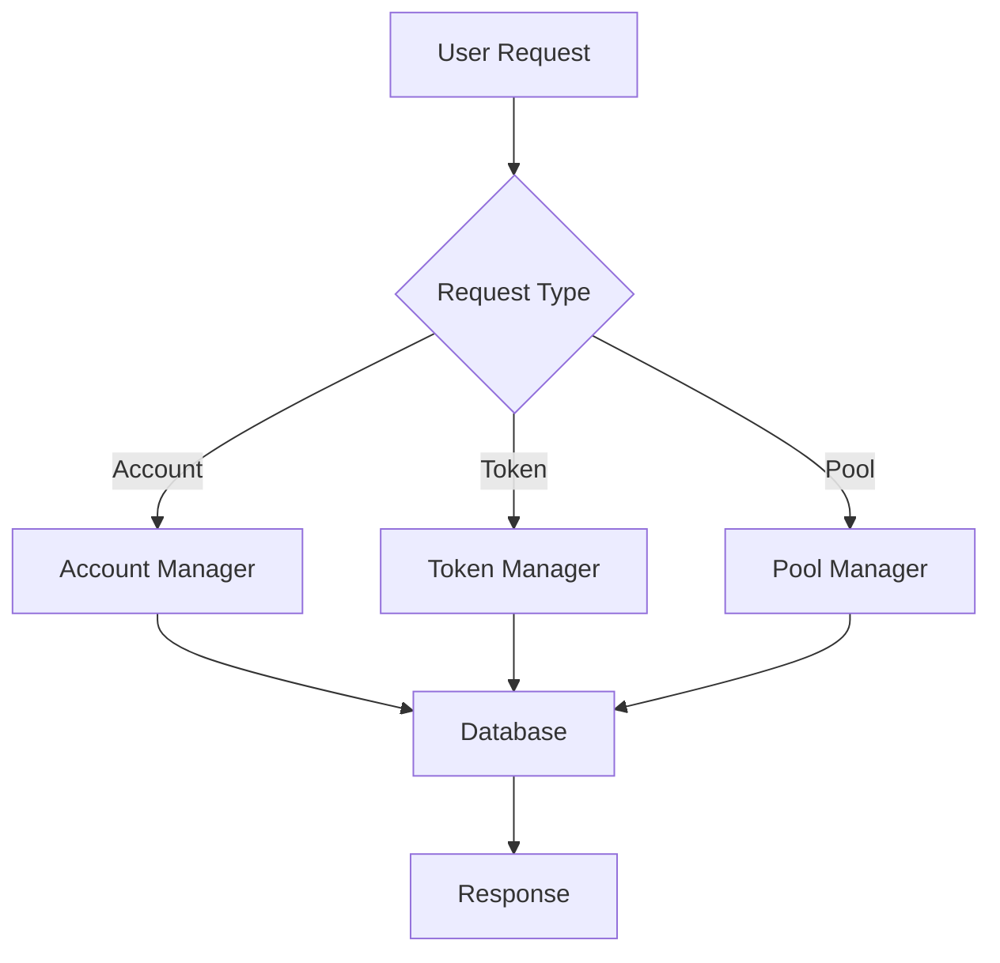

# QENEX Documentation Hub

Comprehensive technical documentation for the QENEX Banking Operating System and complete financial ecosystem.

## 🗺 System Overview

```
┌────────────────────────────────────────────────────────┐
│                   QENEX ECOSYSTEM                      │
├────────────────────────────────────────────────────────┤
│                                                        │
│  ┌──────────────┐  ┌──────────────┐  ┌─────────────┐ │
│  │   Core OS    │  │     DeFi     │  │    Token    │ │
│  │              │◄─┤   Platform   │◄─┤   Contract  │ │
│  │  • Database  │  │              │  │             │ │
│  │  • Accounts  │  │  • AMM Pools │  │  • ERC20    │ │
│  │  • Tokens    │  │  • Swapping  │  │  • Minting  │ │
│  │  • Transfers │  │  • Liquidity │  │  • Burning  │ │
│  └──────────────┘  └──────────────┘  └─────────────┘ │
│                                                        │
└────────────────────────────────────────────────────────┘
```

## 📚 Documentation Structure

### Core System
- [Quick Start Guide](./quickstart.md)
- [Architecture Overview](./architecture.md)
- [API Reference](./api.md)

### DeFi Platform
- [AMM Mathematics](./amm-math.md)
- [Liquidity Provision](./liquidity.md)
- [Trading Guide](./trading.md)

### Token Contract
- [Deployment Guide](./deployment.md)
- [Integration Examples](./integration.md)
- [Security Analysis](./security.md)

## 🚀 Quick Start

### 1. Core System

```bash
# Clone and run
git clone https://github.com/abdulrahman305/qenex-os.git
cd qenex-os
python main.py
```

### 2. DeFi Platform

```bash
# Clone and run
git clone https://github.com/abdulrahman305/qenex-defi.git
cd qenex-defi
python amm.py
```

### 3. Token Contract

```bash
# Clone and compile
git clone https://github.com/abdulrahman305/qxc-token.git
cd qxc-token
# Deploy using Hardhat/Remix
```

## 💡 Key Concepts

### Automated Market Maker (AMM)

The constant product formula ensures liquidity at all price levels:

```
x × y = k

where:
- x = reserve of token A
- y = reserve of token B
- k = constant product
```

### Price Calculation

```python
price_of_A = reserve_B / reserve_A
```

### Swap Output

```python
output = (input × reserve_out) / (reserve_in + input)
```

## 🏗 System Components

### Database Layer
- SQLite for development
- ACID compliance
- Foreign key constraints
- Transaction safety

### Token System
- ERC20 standard
- Decimal precision
- Transfer validation
- Balance tracking

### Liquidity Pools
- Token pairs
- LP token issuance
- Fee collection
- Price discovery

## 📊 Data Flow



## 🔒 Security Model

### Input Validation
- Type checking
- Range validation
- SQL injection prevention

### Transaction Safety
- Atomic operations
- Rollback on error
- Balance validation

### Access Control
- Owner privileges
- Minter roles
- User permissions

## 📈 Performance

| Operation | Complexity | Gas Cost |
|-----------|------------|----------|
| Transfer | O(1) | ~51,000 |
| Swap | O(1) | ~100,000 |
| Add Liquidity | O(1) | ~150,000 |
| Remove Liquidity | O(1) | ~120,000 |

## 🧪 Testing

### Unit Tests
```python
# Core system
python -m pytest tests/

# DeFi platform
python test_amm.py
```

### Integration Tests
```javascript
// Token contract
npx hardhat test
```

## 🛠 Development

### Prerequisites
- Python 3.8+
- Node.js 16+
- SQLite3
- Solidity 0.8.20

### Environment Setup
```bash
# Python dependencies
pip install -r requirements.txt

# Node dependencies
npm install
```

## 📝 API Examples

### Create Account
```python
system = System()
account = system.create_account()
```

### Transfer Tokens
```python
tx_hash = system.tokens.transfer(
    from_addr=sender,
    to_addr=receiver,
    token='ETH',
    amount=Decimal('10')
)
```

### Swap Tokens
```python
output = amm.swap(
    token_in='ETH',
    token_out='USDC',
    amount_in=Decimal('1')
)
```

### Add Liquidity
```python
lp_tokens = amm.add_liquidity(
    provider='alice',
    token0='ETH',
    token1='USDC',
    amount0=Decimal('10'),
    amount1=Decimal('20000')
)
```

## 🌐 Deployment

### Local Development
```yaml
environment: development
database: sqlite
logging: debug
port: 8000
```

### Production
```yaml
environment: production
database: postgresql
logging: info
port: 443
ssl: enabled
```

## 📊 Monitoring

### Metrics
- Transaction throughput
- Pool liquidity
- Gas usage
- Error rates

### Logging
- System events
- User actions
- Error tracking
- Performance metrics

## 🚨 Troubleshooting

### Common Issues

#### Database Locked
```bash
# Check processes
lsof data/main.db

# Kill process
kill -9 <PID>
```

#### Import Error
```bash
# Update dependencies
pip install --upgrade -r requirements.txt
```

#### Compilation Error
```bash
# Check Solidity version
solc --version

# Install correct version
npm install -g solc@0.8.20
```

## 🤝 Contributing

1. Fork repository
2. Create feature branch
3. Commit changes
4. Push to branch
5. Open pull request

## 📄 License

MIT License - See individual repositories for details.

## 🔗 Links

- [Core OS Repository](https://github.com/abdulrahman305/qenex-os)
- [DeFi Platform Repository](https://github.com/abdulrahman305/qenex-defi)
- [Token Contract Repository](https://github.com/abdulrahman305/qxc-token)
- [Documentation Repository](https://github.com/abdulrahman305/qenex-docs)

## ⚠️ Disclaimer

This is an educational implementation. Not audited for production use. Use at your own risk.

---

For support and questions, please open an issue in the respective repository.