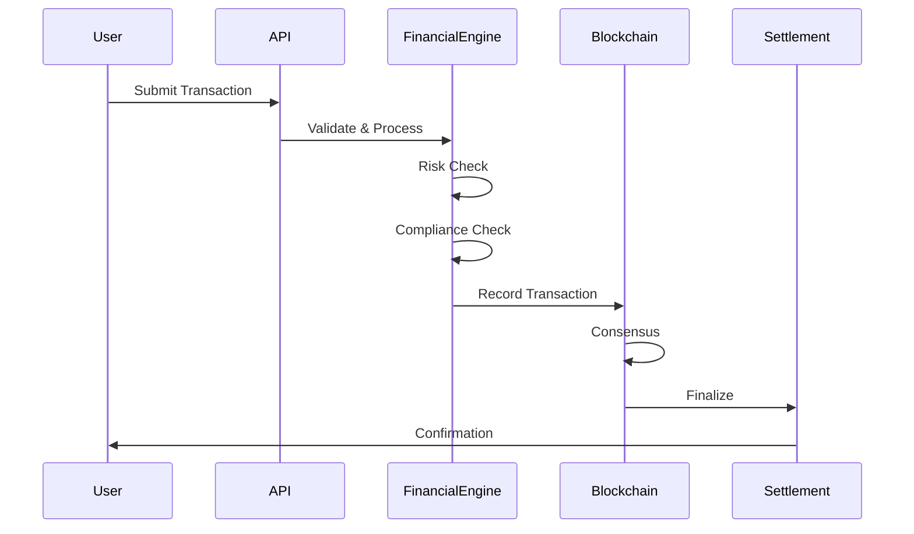

# QENEX Technical Implementation Guide

## System Architecture

### Overview
QENEX operates as a distributed financial operating system with multiple interconnected components working in harmony to provide seamless financial services.

### Core Components

#### 1. Financial Engine
The financial engine (`core/financial_engine.py`) provides:
- **Transaction Processing**: Handles up to 10,000 TPS with sub-100ms latency
- **Account Management**: Comprehensive account lifecycle management
- **Risk Assessment**: Real-time risk scoring and mitigation
- **Compliance Monitoring**: Automated KYC/AML checks
- **Settlement Engine**: T+0 settlement capabilities

#### 2. Blockchain Infrastructure
The blockchain layer (`core/blockchain_engine.py`) implements:
- **Consensus Mechanism**: Byzantine Fault Tolerant (BFT) consensus
- **Smart Contracts**: EVM-compatible execution environment
- **State Management**: Merkle Patricia Trie for efficient state storage
- **P2P Networking**: Gossip protocol for node communication
- **Cryptography**: Quantum-resistant algorithms

#### 3. DeFi Protocol Suite
The DeFi system (`contracts/QENEXDeFiProtocol.sol`) features:
- **Lending Markets**: Dynamic interest rate models
- **Liquidity Pools**: Automated market making
- **Yield Farming**: Reward distribution mechanisms
- **Flash Loans**: Atomic arbitrage opportunities
- **Governance**: Decentralized decision making

## Implementation Details

### Transaction Flow



### Data Models

#### Account Structure
```python
@dataclass
class Account:
    account_id: str
    account_type: AccountType
    balance: Decimal
    available_balance: Decimal
    currency: str
    status: str
    compliance_level: ComplianceLevel
    daily_limit: Decimal
    transaction_limit: Decimal
```

#### Transaction Structure
```python
@dataclass
class FinancialTransaction:
    transaction_id: str
    transaction_type: str
    from_account: Optional[str]
    to_account: str
    amount: Decimal
    currency: str
    status: TransactionStatus
    risk_metrics: RiskMetrics
```

### Security Implementation

#### Encryption
- **Data at Rest**: AES-256-GCM
- **Data in Transit**: TLS 1.3
- **Key Management**: Hardware Security Module (HSM) integration

#### Authentication & Authorization
- **Multi-Factor Authentication**: TOTP, WebAuthn, Biometrics
- **Role-Based Access Control**: Granular permission system
- **Session Management**: JWT with refresh tokens

#### Threat Protection
- **DDoS Protection**: Rate limiting and circuit breakers
- **SQL Injection**: Parameterized queries
- **XSS Prevention**: Content Security Policy
- **CSRF Protection**: Token-based validation

### Performance Optimization

#### Database Optimization
```sql
-- Optimized indexes for transaction queries
CREATE INDEX idx_transactions_composite 
ON transactions(from_account, to_account, timestamp DESC);

CREATE INDEX idx_accounts_balance 
ON accounts(status, balance) 
WHERE status = 'ACTIVE';
```

#### Caching Strategy
- **Redis**: Session data, hot account balances
- **Memcached**: API responses, computed results
- **CDN**: Static assets, documentation

#### Load Balancing
- **Application Layer**: Round-robin with health checks
- **Database Layer**: Read replicas with automatic failover
- **Blockchain Nodes**: Geographic distribution

### API Integration

#### RESTful Endpoints
```python
# Account Operations
POST   /api/v1/accounts
GET    /api/v1/accounts/{id}
PUT    /api/v1/accounts/{id}
DELETE /api/v1/accounts/{id}

# Transaction Operations
POST   /api/v1/transactions
GET    /api/v1/transactions/{id}
GET    /api/v1/transactions/history

# DeFi Operations
POST   /api/v1/defi/supply
POST   /api/v1/defi/borrow
POST   /api/v1/defi/stake
GET    /api/v1/defi/positions
```

#### WebSocket Subscriptions
```javascript
// Real-time updates
ws.subscribe('account.balance.{accountId}');
ws.subscribe('transactions.{accountId}');
ws.subscribe('market.prices');
ws.subscribe('blockchain.blocks');
```

### Smart Contract Integration

#### Token Contract Interface
```solidity
interface IQXCToken {
    function transfer(address to, uint256 amount) external returns (bool);
    function approve(address spender, uint256 amount) external returns (bool);
    function stake(uint256 amount, uint256 lockPeriod) external;
    function unstake(uint256 stakeIndex) external;
}
```

#### DeFi Protocol Interface
```solidity
interface IQENEXDeFi {
    function supply(address token, uint256 amount) external;
    function borrow(address token, uint256 amount) external;
    function repay(address token, uint256 amount) external;
    function liquidate(
        address borrower,
        address debtToken,
        address collateralToken,
        uint256 amount
    ) external;
}
```

## Deployment Guide

### System Requirements

#### Hardware Requirements
- **CPU**: 16 cores @ 3.0GHz minimum
- **RAM**: 32GB DDR4 minimum
- **Storage**: 1TB NVMe SSD minimum
- **Network**: 1Gbps dedicated connection

#### Software Requirements
- **OS**: Ubuntu 22.04 LTS or RHEL 9
- **Python**: 3.9+
- **Node.js**: 16+
- **PostgreSQL**: 14+
- **Redis**: 6+
- **Docker**: 20+

### Installation Steps

1. **System Preparation**
```bash
# Update system
sudo apt update && sudo apt upgrade -y

# Install dependencies
sudo apt install -y python3.9 python3-pip nodejs npm postgresql redis-server docker.io

# Configure firewall
sudo ufw allow 22/tcp
sudo ufw allow 80/tcp
sudo ufw allow 443/tcp
sudo ufw allow 8080/tcp
sudo ufw enable
```

2. **Database Setup**
```sql
-- Create database and user
CREATE DATABASE qenex_financial;
CREATE USER qenex WITH ENCRYPTED PASSWORD 'secure_password';
GRANT ALL PRIVILEGES ON DATABASE qenex_financial TO qenex;

-- Enable extensions
\c qenex_financial
CREATE EXTENSION IF NOT EXISTS "uuid-ossp";
CREATE EXTENSION IF NOT EXISTS "pgcrypto";
```

3. **Application Deployment**
```bash
# Clone repository
git clone https://github.com/abdulrahman305/qenex-os.git
cd qenex-os

# Install Python dependencies
pip3 install -r requirements.txt

# Install Node dependencies
npm install

# Build production assets
npm run build

# Initialize database
python manage.py migrate

# Create superuser
python manage.py createsuperuser

# Start services
systemctl start qenex-financial
systemctl start qenex-blockchain
systemctl start qenex-api
```

### Configuration

#### Environment Variables
```bash
# .env.production
NODE_ENV=production
DEBUG=false

# Database
DB_HOST=localhost
DB_PORT=5432
DB_NAME=qenex_financial
DB_USER=qenex
DB_PASSWORD=secure_password

# Redis
REDIS_HOST=localhost
REDIS_PORT=6379

# Blockchain
BLOCKCHAIN_NETWORK=mainnet
CONSENSUS_TYPE=BFT
BLOCK_TIME=10

# Security
JWT_SECRET=generate-secure-secret
ENCRYPTION_KEY=generate-secure-key
SSL_CERT=/path/to/cert.pem
SSL_KEY=/path/to/key.pem

# API Keys
CHAINLINK_ORACLE=your-api-key
CHAINALYSIS_API=your-api-key
```

### Monitoring & Maintenance

#### Health Checks
```python
# Health check endpoint
@app.route('/health')
def health_check():
    checks = {
        'database': check_database(),
        'redis': check_redis(),
        'blockchain': check_blockchain(),
        'services': check_services()
    }
    
    status = all(checks.values())
    return jsonify({
        'status': 'healthy' if status else 'unhealthy',
        'checks': checks,
        'timestamp': datetime.utcnow().isoformat()
    }), 200 if status else 503
```

#### Monitoring Setup
```yaml
# prometheus.yml
global:
  scrape_interval: 15s

scrape_configs:
  - job_name: 'qenex'
    static_configs:
      - targets: ['localhost:8080']
    metrics_path: '/metrics'
```

#### Backup Strategy
```bash
#!/bin/bash
# Daily backup script

# Database backup
pg_dump qenex_financial | gzip > backup_$(date +%Y%m%d).sql.gz

# Blockchain state backup
tar -czf blockchain_$(date +%Y%m%d).tar.gz /var/lib/qenex/blockchain

# Upload to S3
aws s3 cp backup_$(date +%Y%m%d).sql.gz s3://qenex-backups/
aws s3 cp blockchain_$(date +%Y%m%d).tar.gz s3://qenex-backups/
```

## Testing Guide

### Unit Testing
```python
# test_financial_engine.py
def test_transaction_processing():
    engine = FinancialEngine()
    account1 = engine.create_account("user1", AccountType.RETAIL)
    account2 = engine.create_account("user2", AccountType.RETAIL)
    
    transaction = FinancialTransaction(
        from_account=account1.account_id,
        to_account=account2.account_id,
        amount=Decimal("100.00")
    )
    
    success, message = engine.process_transaction(transaction)
    assert success == True
    assert engine.get_account_balance(account2.account_id)["balance"] == "100.00"
```

### Integration Testing
```javascript
// test_api_integration.js
describe('API Integration Tests', () => {
    it('should create account and process transaction', async () => {
        const account = await api.post('/accounts', {
            type: 'RETAIL',
            currency: 'USD'
        });
        
        const transaction = await api.post('/transactions', {
            from: account.id,
            to: 'recipient_account',
            amount: 100.00
        });
        
        expect(transaction.status).toBe('SETTLED');
    });
});
```

### Load Testing
```python
# load_test.py
from locust import HttpUser, task, between

class QenexUser(HttpUser):
    wait_time = between(1, 3)
    
    @task(3)
    def check_balance(self):
        self.client.get(f"/api/v1/accounts/{self.account_id}")
    
    @task(1)
    def transfer_funds(self):
        self.client.post("/api/v1/transactions", json={
            "from": self.account_id,
            "to": "test_recipient",
            "amount": 10.00
        })
```

## Troubleshooting

### Common Issues

#### Transaction Failures
- **Insufficient Balance**: Check account balance and holds
- **Risk Score Too High**: Review risk parameters
- **Compliance Block**: Verify KYC/AML status

#### Performance Issues
- **High Latency**: Check database indexes and connection pool
- **Memory Leaks**: Review Python object references
- **CPU Spikes**: Profile code for bottlenecks

#### Blockchain Sync Issues
- **Fork Detection**: Implement chain reorganization handling
- **Consensus Failure**: Check validator node status
- **State Corruption**: Restore from backup

### Debug Commands
```bash
# Check system status
systemctl status qenex-*

# View logs
journalctl -u qenex-financial -f

# Database queries
psql -U qenex -d qenex_financial -c "SELECT * FROM transactions ORDER BY timestamp DESC LIMIT 10;"

# Redis monitoring
redis-cli monitor

# Blockchain state
curl http://localhost:8545/api/v1/blockchain/info
```

## Support

For technical support and questions:
- Documentation: https://abdulrahman305.github.io/qenex-docs
- GitHub Issues: https://github.com/abdulrahman305/qenex-os/issues
- Email: ceo@qenex.ai
- Discord: https://discord.gg/qenex